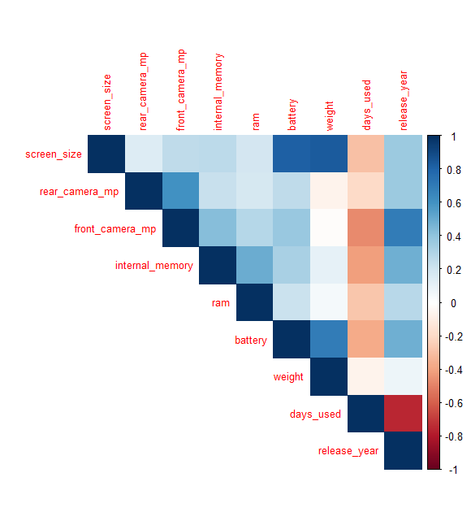
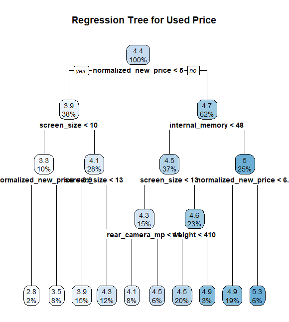
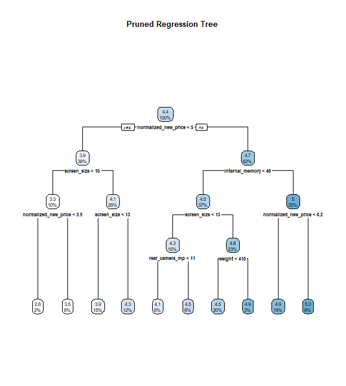
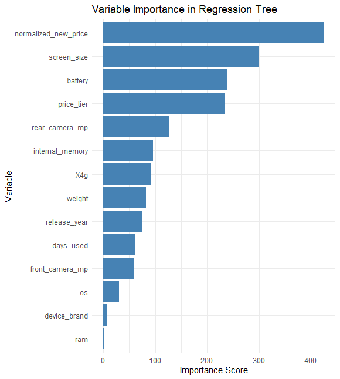

# Data-Driven Pricing for Used Smartphones Using Regression and Decision Trees

## Project Overview

This project explores how data analytics can help recommerce firms bring **consistency and transparency** to the used smartphone market.  
Using multiple machine learning models — **linear regression**, **regression trees**, and **M5P model trees** — I built predictive models in R that estimate the normalized used price of smartphones and classify them into high- and low-value tiers.  

The analysis goes beyond pure prediction: it reflects how structured data preparation, feature engineering, and interpretability-focused modeling can turn raw device data into **practical pricing intelligence**.  
The end goal was to help a recommerce client automate fair price estimation, reduce human bias, and improve profitability through data-driven decision-making.

---

## Objective / Business Problem

The client, a mid-sized **recommerce firm**, faced a familiar yet complex challenge: **inconsistent and subjective pricing**.  
While manufacturers use controlled models to set prices for new devices, recommerce firms deal with thousands of used smartphones — all varying in age, features, and condition.  
Pricing was handled manually by appraisers who relied on experience and gut feeling. As a result, two phones with nearly identical configurations could receive very different offers, depending on who assessed them.  

This inconsistency led to **fluctuating profit margins, longer inventory cycles, and uneven customer trust** across regions.  
The firm’s leadership wanted to shift to a **data-driven pricing system** that could estimate fair resale prices and segment phones into value tiers with minimal manual input.  

The business objectives were clear:
1. Predict the **normalized used price** of a smartphone based on technical and historical data.  
2. Classify devices into **price tiers** (high vs. low value) to guide procurement and resale strategy.  

The challenge was to design a solution that wasn’t just accurate — it had to be **interpretable**, scalable, and aligned with how real-world appraisers think.

---

## Analytical Approach

The dataset contained **3,454 smartphone entries**, each described by 15 variables including screen size, RAM, camera specs, battery capacity, release year, and both new and used normalized prices.  

While the structure appeared clean, the first deep dive revealed key data issues that shaped the modeling strategy.  
The most significant was that both price columns — *new* and *used* — were already **normalized**, but the client couldn’t explain how. It was unclear whether normalization reflected scaling, inflation adjustments, or exchange rate standardization.  

Because of this ambiguity, the analysis shifted from predicting **absolute prices** to modeling **relative pricing behavior** — identifying which features most strongly influenced resale value.  
This reframing made the findings reliable and business-usable, even without knowing the exact normalization logic.

Data cleaning involved:
- **Group-wise median imputation** (by brand, OS, release year) to handle missing values realistically.  
- **Flagging implausible combinations**, such as front cameras with higher megapixels than rear ones or devices with RAM larger than storage capacity.  
- Creating a new categorical variable, **`price_tier`**, to distinguish high- and low-value phones based on their normalized new price.

Feature exploration included **correlation mapping** to check for redundant predictors and identify dominant relationships between variables such as internal memory, RAM, and price.

This systematic approach ensured that models learned from realistic and relevant relationships — not statistical noise.

---

## Technical Reading

The modeling process followed three tiers of complexity, balancing **explainability** and **predictive power**:

1. **Multiple Linear Regression** — served as a baseline, quantifying the influence of each feature on used price.  
2. **Regression Tree (rpart)** — captured non-linear relationships and threshold effects that align with human decision-making (e.g., jumps in value after certain screen sizes or memory levels).  
3. **M5P Model Tree (RWeka)** — combined both methods by fitting linear regressions at each tree node, improving accuracy while preserving interpretability.

For classification, a **decision tree** model was built to separate devices into high- and low-value tiers — a useful rule-based tool for business users.

The **regression tree visualization** clearly showed how specifications like screen size and new price split the data into distinct pricing segments:

After pruning based on complexity parameter (CP), the **simplified tree** offered clear, explainable logic paths — ideal for real-world decision support.

Finally, the **variable importance plot** highlighted the top predictors of used price, confirming that normalized new price, screen size, and memory capacity consistently drive resale value.

All modeling was implemented in **R**, using packages like `dplyr`, `rpart`, `RWeka`, `caret`, and `ggplot2` for data transformation, modeling, validation, and visualization.  
Model performance was measured using **RMSE** and **MAE** for regression, and **accuracy** and **recall** for classification tasks.

---

## Evaluation Metrics & Results

Three regression-based approaches were tested to predict normalized used prices.  
Each represented a trade-off between simplicity, accuracy, and interpretability.

| Model | RMSE | MAE | Interpretation |
|:------|:-----|:----|:----------------|
| **Linear Regression** | 0.318 | 0.238 | Strong baseline; explains broad linear trends |
| **Regression Tree (Pruned)** | 0.291 | 0.225 | Captures intuitive price thresholds; visually interpretable |
| **M5P Model Tree** | **0.236** | **0.187** | Most accurate; balances segmentation and regression precision |

The **M5P model** achieved the best test performance, reducing average error significantly while remaining explainable.  
Its hybrid nature allowed local linear fits within distinct price regions — meaning the same feature could have slightly different effects for budget and premium devices.

In practical terms, this translates to **fewer pricing discrepancies** and more **consistent valuation outcomes**, supporting both operational accuracy and customer fairness.

---

## Key Insights & Business Implications

This project produced clear and actionable findings about the drivers of resale value:

- **Screen size**, **memory capacity**, and **normalized new price** were consistently the strongest predictors across all models.  
- **Brand effects** revealed differentiated depreciation rates — mid-range brands lost value faster, while flagship brands retained their worth longer.  
- **Release year** had a moderate influence once specifications were accounted for, showing that hardware features dominate over age alone.

From a business perspective, these insights open several strategic opportunities:

1. Introduce **dynamic pricing bands** that automatically adjust by device specifications rather than relying on static depreciation tables.  
2. Apply **brand-level adjustment factors** to reflect real consumer perception and resale behavior.  
3. Clarify or revisit the **price normalization process** to make future models more interpretable and deployment-ready.

Even with incomplete data lineage, this analysis demonstrated that predictive modeling can bring measurable improvements to consistency, fairness, and efficiency in recommerce pricing.

---

## Conclusion & Next Steps

This project shows how structured analytics can transform a subjective, experience-based process into a **data-driven pricing system**.  
Among all approaches, the **M5 Model Tree** proved the most effective — balancing accuracy, interpretability, and real-world usability.

For future development, the client could:
- Enrich the model with **market context features** like demand trends or seasonal effects.  
- Deploy a **web-based price recommendation dashboard** for appraisers.  
- Implement **model monitoring** to track performance over time and adapt to market shifts.

Ultimately, this work provides a solid analytical foundation for **scalable, transparent, and fair recommerce pricing**, bridging the gap between human intuition and data-driven insight.

---

## Skills Demonstrated / Key Takeaways

This project brought together the complete data analytics lifecycle — from raw data preparation to business interpretation.  

On the **technical side**, I worked extensively in **R**, using:
- `dplyr` for cleaning and transformation  
- `rpart` and `RWeka` for regression and model trees  
- `caret` for validation and performance evaluation  
- `ggplot2` for visualization and communication of insights  

More importantly, the project emphasized the **intersection of analytics and business strategy**:  
it wasn’t about building the most complex model, but about designing one that appraisers, managers, and executives could **trust, interpret, and act upon**.

---

## Author

**Rishi Sanmitra Pillutla**  
Aspiring Data Analyst | Transforming Raw Data into Actionable Business Insights  

🔗 [LinkedIn](https://www.linkedin.com/in/rishisanmitra/)  
🔗 [DataSciencePortfol.io](https://www.datascienceportfol.io/rishisanmitra12)
